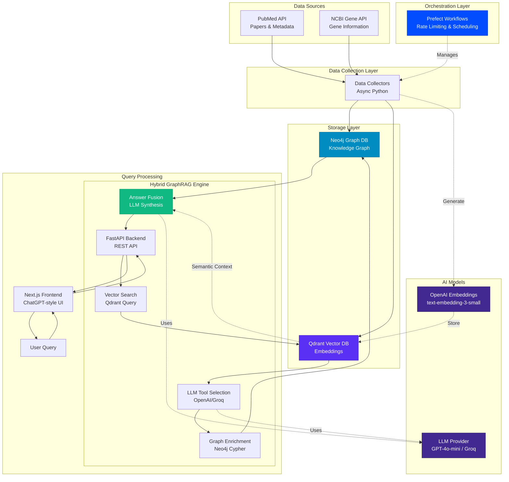

# Biomedical GraphRAG


<div align="center">

<!-- Project Status -->

[](https://opensource.org/licenses/MIT)
[](https://www.python.org/downloads/)
[](https://github.com/astral-sh/uv)

<!-- Providers -->

[](https://qdrant.tech/)
[](https://neo4j.com/)
[](https://openai.com/)
[](https://prefect.io/)
[](https://nextjs.org/)
[](https://fastapi.tiangolo.com/)

<!-- Deployment Status -->

[](https://biomedical-graphrag-api.onrender.com)
[](https://stats.uptimerobot.com/UR74DMbMBT)

**📊 [View Live Uptime Dashboard](https://stats.uptimerobot.com/UR74DMbMBT)**

</div>

## Table of Contents

- [Biomedical GraphRAG](#biomedical-graphrag)
  - [Table of Contents](#table-of-contents)
  - [Overview](#overview)
  - [Architecture](#architecture)
    - [System Architecture Overview](#system-architecture-overview)
    - [Query Flow Details](#query-flow-details)
    - [Technology Stack](#technology-stack)
  - [Live Deployment](#live-deployment)
  - [Attribution](#attribution)
  - [Project Structure](#project-structure)
  - [Prerequisites](#prerequisites)
  - [Installation](#installation)
  - [Usage](#usage)
    - [Configuration](#configuration)
    - [Data Collection](#data-collection)
    - [Infrastructure Setup](#infrastructure-setup)
      - [Neo4j Graph Database](#neo4j-graph-database)
      - [Qdrant Vector Database](#qdrant-vector-database)
    - [Orchestration](#orchestration)
      - [Prefect Setup](#prefect-setup)
      - [Deployment Commands](#deployment-commands)
      - [Available Flows](#available-flows)
      - [Rate Limiting](#rate-limiting)
    - [Web Interface](#web-interface)
      - [FastAPI Backend](#fastapi-backend)
      - [Next.js Frontend](#nextjs-frontend)
    - [Query Commands](#query-commands)
      - [Qdrant Vector Search](#qdrant-vector-search)
      - [Hybrid Neo4j + Qdrant Queries](#hybrid-neo4j--qdrant-queries)
      - [Available Query Types](#available-query-types)
      - [Sample Queries](#sample-queries)
    - [Testing](#testing)
    - [Quality Checks](#quality-checks)
  - [License](#license)

## Overview

A comprehensive GraphRAG (Graph Retrieval-Augmented Generation) system designed for biomedical research. It combines knowledge graphs with vector search to provide intelligent querying and analysis of biomedical literature and genomic data.

**Key Features:**

- **Hybrid Query System**: Combines Neo4j graph database with Qdrant vector search for comprehensive biomedical insights
- **Modern Web Interface**: ChatGPT-style interface built with Next.js and FastAPI for intuitive research exploration
- **Data Integration**: Processes PubMed papers, gene data, and research citations
- **Intelligent Querying**: Uses LLM-powered tool selection for graph enrichment and semantic search
- **Biomedical Schema**: Specialized graph schema for papers, authors, institutions, genes, and MeSH terms
- **Async Processing**: High-performance async data collection and processing
- **Production Orchestration**: Prefect-based workflow orchestration with adaptive rate limiting and automated updates

## Architecture

### System Architecture Overview



### Query Flow Details

**Step 1: Vector Search (Qdrant)**
- User question → Embedding generation
- Semantic similarity search across papers
- Returns top-k most relevant documents

**Step 2: Graph Enrichment (Neo4j)**
- LLM analyzes question + Qdrant results
- Automatically selects relevant Neo4j tools:
  - Author collaboration networks
  - Gene co-occurrence analysis
  - MeSH term relationships
  - Citation networks

**Step 3: Answer Fusion**
- Combines vector search results + graph data
- LLM synthesizes comprehensive answer
- Returns answer with supporting papers

### Technology Stack

| Layer | Technology | Purpose |
|-------|------------|---------|
| **Frontend** | Next.js 14, TailwindCSS, TypeScript | User interface with real-time streaming |
| **Backend** | FastAPI, Python 3.13, Async/Await | REST API with high performance |
| **Graph Database** | Neo4j 5.28 | Knowledge graph (papers, authors, genes) |
| **Vector Database** | Qdrant 1.15 | Semantic search with embeddings |
| **AI Models** | OpenAI GPT-4o-mini, Groq, Embeddings | LLM reasoning & vector generation |
| **Orchestration** | Prefect 3.2, PostgreSQL | Workflow automation & scheduling |
| **Data Sources** | PubMed E-utilities, NCBI Gene API | Biomedical literature & gene data |

## Live Deployment

This project is deployed and running on free-tier cloud services:

- **API Backend**: [https://biomedical-graphrag-api.onrender.com](https://biomedical-graphrag-api.onrender.com) (Render)
- **Uptime Monitoring**: [View Dashboard](https://stats.uptimerobot.com/UR74DMbMBT) (UptimeRobot - 5min checks)
- **Graph Database**: Neo4j Aura (Free Tier - 50k nodes, 175k relationships)
- **Vector Database**: Qdrant Cloud (Free Tier - 1GB storage)
- **Orchestration**: Prefect Cloud (Free Tier - 20k task runs/month)
- **AI Model**: Groq (Free - 14,400 requests/day)

**Total Monthly Cost**: $0 🎉

> **Note**: The Render free tier spins down after 15 minutes of inactivity. UptimeRobot keeps the API warm with automated health checks every 5 minutes. First request after sleep takes ~30 seconds.

For deployment instructions, see [DEPLOYMENT.md](DEPLOYMENT.md).

## Attribution

This project is based on [biomedical-graphrag](https://github.com/benitomartin/biomedical-graphrag) by [Benito Martin](https://github.com/benitomartin).

See his excellent article: [Building a Biomedical GraphRAG: When Knowledge Graphs Meet Vector Search](https://aiechoes.substack.com/p/building-a-biomedical-graphrag-when)

### Enhancements

This fork includes production-ready enhancements:

- **Web Interface**: Modern ChatGPT-style UI with Next.js frontend and FastAPI backend for intuitive research exploration
- **Prefect Orchestration**: Adaptive rate limiting with circuit breaker pattern, weekly incremental updates, and monthly full rebuilds
- **Production Infrastructure**: Docker Compose setup, work pools, and deployment configurations
- **Enhanced Documentation**: Comprehensive orchestration guides and project structure documentation
- **Improved Organization**: Restructured directories for better maintainability

For detailed credits, see [CREDITS.md](CREDITS.md).

## Project Structure

```text
biomedical-graphrag/
├── .github/                    # GitHub workflows and templates
├── data/                       # Dataset storage (PubMed, Gene data)
├── deployment/                 # Deployment configurations
│   ├── docker-compose.prefect.yml  # Prefect infrastructure
│   ├── Dockerfile.prefect          # Worker container
│   └── README.md
├── docs/                       # Documentation
│   ├── ORCHESTRATION.md            # Full orchestration guide
│   └── QUICKSTART_ORCHESTRATION.md # Quick start guide
├── frontend/                   # Next.js web application
│   ├── app/                    # Next.js 14 app directory
│   │   ├── page.tsx            # Landing page with statistics
│   │   └── query/page.tsx      # ChatGPT-style query interface
│   ├── lib/                    # Frontend utilities
│   │   ├── api.ts              # Type-safe API client
│   │   └── utils.ts            # Helper functions
│   ├── package.json            # Frontend dependencies
│   └── README.md               # Frontend setup guide
├── scripts/                    # Utility scripts
│   ├── deploy_flows.py            # Deploy Prefect flows
│   ├── run_flow.py                # Test flow execution
│   └── README.md
├── src/
│   └── biomedical_graphrag/
│       ├── api/                # FastAPI backend
│       │   ├── main.py         # FastAPI application
│       │   ├── models/         # Request/Response schemas
│       │   └── routes/         # API endpoints
│       ├── application/        # Application layer
│       │   ├── cli/            # Command-line interfaces
│       │   └── services/       # Business logic services
│       ├── config.py           # Configuration management
│       ├── data_sources/       # Data collection modules
│       ├── domain/             # Domain models and entities
│       ├── infrastructure/     # Database and external service adapters
│       ├── orchestration/      # Prefect workflows
│       │   ├── flows.py        # Main orchestration flows
│       │   ├── tasks.py        # Prefect tasks
│       │   └── rate_limiter.py # Rate limiting logic
│       └── utils/              # Utility functions
├── static/                     # Static assets (images, etc.)
├── tests/                      # Test suite
├── CREDITS.md                  # Attribution and credits
├── LICENSE                     # MIT License
├── Makefile                    # Build and development commands
├── prefect.yaml                # Prefect configuration
├── PROJECT_STRUCTURE.md        # Detailed structure guide
├── pyproject.toml              # Project configuration and dependencies
├── README.md                   # This file
└── uv.lock                     # Dependency lock file
```

## Prerequisites

| Requirement                                            | Description                                      |
| ------------------------------------------------------ | ------------------------------------------------ |
| [Python 3.13+](https://www.python.org/downloads/)      | Programming language                             |
| [uv](https://docs.astral.sh/uv/)                       | Package and dependency manager                   |
| [Neo4j](https://neo4j.com/)                            | Graph database for knowledge graphs              |
| [Qdrant](https://qdrant.tech/)                         | Vector database for embeddings                   |
| [OpenAI](https://openai.com/)                          | LLM provider for queries and embeddings          |
| [Prefect](https://prefect.io/)                         | Workflow orchestration (optional, for automation)|
| [Docker](https://www.docker.com/)                      | Container platform (optional, for Prefect)       |
| [PubMed](https://www.ncbi.nlm.nih.gov/books/NBK25501/) | Biomedical literature database                   |

## Installation

1. Clone the repository:

   ```bash
   git clone https://github.com/paul-data-ai/biomedical_graphrag.git
   cd biomedical_graphrag
   ```

1. Create a virtual environment:

   ```bash
   uv venv
   ```

1. Activate the virtual environment:

   ```bash
   source .venv/bin/activate
   ```

1. Install the required packages:

   ```bash
   uv sync --all-groups --all-extra
   ```

1. Create a `.env` file in the root directory:

   ```bash
    cp env.example .env
   ```

## Usage

### Configuration

Configure API keys, model names, and other settings by editing the `.env` file:

```bash
# OpenAI Configuration
OPENAI__API_KEY=your_openai_api_key_here
OPENAI__MODEL=gpt-4o-mini
OPENAI__TEMPERATURE=0.0
OPENAI__MAX_TOKENS=1500

# Neo4j Configuration
NEO4J__URI=bolt://localhost:7687
NEO4J__USERNAME=neo4j
NEO4J__PASSWORD=your_neo4j_password
NEO4J__DATABASE=neo4j

# Qdrant Configuration
QDRANT__URL=http://localhost:6333
QDRANT__API_KEY=your_qdrant_api_key
QDRANT__COLLECTION_NAME=biomedical_papers
QDRANT__EMBEDDING_MODEL=text-embedding-3-small
QDRANT__EMBEDDING_DIMENSION=1536

# PubMed Configuration (optional)
PUBMED__EMAIL=your_email@example.com
PUBMED__API_KEY=your_pubmed_api_key

# Data Paths
JSON_DATA__PUBMED_JSON_PATH=data/pubmed_dataset.json
JSON_DATA__GENE_JSON_PATH=data/gene_dataset.json
```

### Data Collection

The system includes data collectors for biomedical and gene datasets:

```bash
# Collect PubMed papers and metadata
make pubmed-data-collector-run
```

```bash
# Collect gene information related to the pubmed dataset
make gene-data-collector-run
```

### Infrastructure Setup

#### Neo4j Graph Database

```bash
# Create the knowledge graph from datasets
make create-graph

# Delete all graph data (clean slate)
make delete-graph
```

#### Qdrant Vector Database

```bash
# Create vector collection for embeddings
make create-qdrant-collection

# Ingest embeddings into Qdrant
make ingest-qdrant-data

# Delete vector collection
make delete-qdrant-collection
```

### Orchestration

Production-ready workflow orchestration with Prefect for automated data updates, rate limiting, and error handling.

**Requirements:**
- Prefect 3.x (server and client)
- Docker and Docker Compose
- PostgreSQL (automatically provisioned via Docker)

#### Prefect Setup

Start the Prefect server with Docker Compose (includes PostgreSQL database and worker):

```bash
# Start Prefect server (UI at http://localhost:4200)
make prefect-server-start

# View logs
make prefect-server-logs

# Stop server
make prefect-server-stop
```

Deploy flows to Prefect server:

```bash
# Deploy all flows from prefect.yaml
make prefect-deploy
```

Access the Prefect UI at `http://localhost:4200/deployments` to view and trigger flows.

#### Deployment Commands

```bash
# Manually trigger incremental update (weekly)
make prefect-run-incremental

# Manually trigger full rebuild (monthly)
make prefect-run-rebuild

# Test rate limiting with small dataset
make prefect-test-rate-limit
```

#### Available Flows

**Incremental Update Flow** (Weekly)
- Collects new PubMed papers and gene data
- Updates existing graph and vector store
- Uses MERGE operations to avoid duplicates
- Scheduled to run weekly (configurable)

**Full Rebuild Flow** (Monthly)
- Validates configuration
- Collects complete dataset
- Rebuilds graph and vector store from scratch
- Runs validation checks
- Scheduled to run monthly (configurable)

**Test Flow**
- Quick validation with small dataset
- Tests rate limiting behavior
- Useful for development and debugging

#### Rate Limiting

The orchestration system includes adaptive rate limiting with circuit breaker pattern:

**Features:**
- Token bucket algorithm for burst support
- Sliding window for per-minute limits
- Circuit breaker states: CLOSED → OPEN → HALF_OPEN
- Exponential backoff with jitter for retries
- Automatic recovery from API failures

**Configuration:**
- PubMed API: 3 requests/second (default)
- Customizable via `RateLimitConfig` in `rate_limiter.py`

**Circuit Breaker:**
- Opens after 5 consecutive failures
- Half-open after 60-second cooldown
- Automatically closes on successful requests

For detailed orchestration documentation, see:
- [docs/ORCHESTRATION.md](docs/ORCHESTRATION.md) - Comprehensive guide
- [docs/QUICKSTART_ORCHESTRATION.md](docs/QUICKSTART_ORCHESTRATION.md) - Quick start

### Web Interface

Modern web application for intuitive biomedical research exploration. Built with FastAPI backend and Next.js frontend.

**Features:**
- ChatGPT-style conversational interface for natural language queries
- Beautiful landing page with live database statistics
- Real-time integration with Neo4j and Qdrant
- Responsive design with Tailwind CSS
- Type-safe API communication with TypeScript

#### FastAPI Backend

The FastAPI backend provides a production-ready REST API for querying the biomedical knowledge graph.

**Start the API server:**

```bash
# Development mode with hot reload (recommended)
make api-start

# Production mode with multiple workers
make api-start-prod
```

The API will be available at `http://localhost:8000` with interactive documentation at `http://localhost:8000/docs`.

**API Endpoints:**
- `POST /api/query/` - Natural language queries with hybrid search
- `POST /api/search/` - Vector similarity search
- `POST /api/graph/explore` - Graph traversal and exploration
- `GET /api/health/` - System health monitoring
- `GET /api/stats/` - Database statistics

#### Next.js Frontend

The Next.js frontend provides a modern, user-friendly interface for researchers.

**Setup and run:**

```bash
cd frontend

# Install dependencies
npm install

# Start development server
npm run dev
```

The frontend will be available at `http://localhost:3000`.

**Configuration:**

Create a `.env.local` file in the `frontend/` directory:

```bash
NEXT_PUBLIC_API_URL=http://localhost:8000
```

**Pages:**
- `/` - Landing page with statistics and example queries
- `/query` - ChatGPT-style conversational query interface

For detailed frontend documentation, see [frontend/README.md](frontend/README.md).

### Query Commands

#### Qdrant Vector Search

```bash
# Run a custom query on the Qdrant vector store
make custom-qdrant-query QUESTION="Which institutions have collaborated most frequently on papers about 'Gene Editing' and 'Immunotherapy'?"

# Or run directly with the CLI
uv run src/biomedical_graphrag/application/cli/query_vectorstore.py --ask "Which institutions have collaborated most frequently on papers about 'Gene Editing' and 'Immunotherapy'?"
```

#### Hybrid Neo4j + Qdrant Queries

```bash
# Run example queries on the Neo4j graph using GraphRAG
make example-graph-query

# Run a custom natural language query using hybrid GraphRAG
make custom-graph-query QUESTION="What are the latest research trends in cancer immunotherapy?"

# Or run directly with the CLI
uv run src/biomedical_graphrag/application/cli/fusion_query.py "What are the latest research trends in cancer immunotherapy?"
```

#### Available Query Types

**Qdrant Queries:**

- Semantic search across paper abstracts and content
- Similarity-based retrieval using embeddings
- Direct vector similarity queries

**Hybrid Queries:**

- Combines semantic search (Qdrant) with graph enrichment (Neo4j):
  - Author collaboration networks
  - Citation analysis and paper relationships
  - Gene-paper associations
  - MeSH term relationships
  - Institution affiliations
- LLM-powered automatic tool selection

#### Sample Queries

- Who collaborates with Jennifer Doudna on CRISPR research?
  Which researchers work with Emmanuelle Charpentier on gene editing or genome engineering papers?

- Who are George Church’s collaborators publishing on synthetic biology and genome sequencing?

- List scientists collaborating with Feng Zhang on neuroscience studies

- Which papers are related to PMID 31295471 based on shared MeSH terms?

- Find papers similar to the CRISPR-Cas9 genome editing study with PMID 31295471

- Show other studies linked by MeSH terms to PMID 27562951

- Which genes are mentioned in the same papers as gag?

- What genes appear together with HIF1A in cancer research?

- Which genes are frequently co-mentioned with TP53?

### Testing

Run all tests:

```bash
make tests
```

### Quality Checks

Run all quality checks (lint, format, type check, clean):

```bash
make all-check
make all-fix
```

Individual Commands:

- Display all available commands:

  ```bash
  make help
  ```

- Check code static typing

  ```bash
  make mypy
  ```

- Clean cache and build files:

  ```bash
  make clean
  ```

## License

This project is licensed under the MIT License - see the [LICENSE](LICENSE) file for details.
